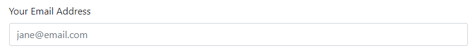
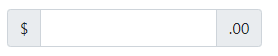

# Bootstrap

O Bootstrap é uma biblioteca de código CSS e JavaScript que você pode combinar para criar rapidamente sites visualmente atraentes.

- Outro aspecto importante do desenvolvimento moderno  são as grades responsivas que permitem que as  páginas da Web adaptem seu layout e conteúdo dependendo do dispositivo em que são visualizadas. O Bootstrap vem com um conjunto pré-criado de regras CSS para criar uma grade responsiva.

    - O Bootstrap economiza tempo significativo porque todo o código CSS que estiliza sua grade e componentes pré-construídos já está escrito. Em vez de ter que ter um alto nível de experiência em vários conceitos de CSS, você pode simplesmente usar as classes CSS do Bootstrap existentes para produzir sites de boa aparência. Isso é indispensável quando você precisa iterar rapidamente em layouts de sites. 

## Usando a documentação do Bootstrap

O Bootstrap vem com documentação detalhada sobre como configurar e usar os recursos disponíveis em sua biblioteca. A documentação é clara e tem muitos exemplos de código para ajudá-lo a começar.

[Documentação do Bootstrap](https://getbootstrap.com/docs)


### Navegando na documentação

A barra lateral na página da Web permite que você navegue pelas diferentes seções da documentação. Há também uma caixa de pesquisa se você precisar procurar uma informação específica.


### Layout

A seção de layout da documentação descreve como usar o sistema de grade do Bootstrap. Isso abrange o que você aprendeu até agora e inclui uso mais avançado, como deslocamentos, alinhamento de colunas, layout automático e colunas de largura variável.


### Conteúdo

A seção de conteúdo da documentação descreve o estilo de texto padrão do Bootstrap e como usar imagens e tabelas responsivas. Você aprendeu o básico deles anteriormente e esta seção entra em mais detalhes.


### Forms

A seção de formulários da documentação descreve como criar formulários usando os estilos do Bootstrap. A biblioteca tem muitas regras CSS para melhorar a interface do usuário e a experiência do formulário. Abaixo estão alguns recursos que você usará com frequência como desenvolvedor:


### Estilo de formulário

O Bootstrap inclui regras CSS para melhorar o estilo visual dos elementos de entrada.

Por exemplo:



Esta tabela descreve os diferentes elementos de formulário HTML e qual classe CSS do Bootstrap deve ser usada para eles.

| Elemento de formulário   | Classe CSS               |
|--------------------------|--------------------------|
| Entrada                  | controle de formulário   |
| <input type="checkbox">  | formulário-check-input   |
| <input type="radio">     | formulário-check-input   |
| <input type="range">     | intervalo de formulários |
| <select>                 | seleção de formulário    |

O uso dessas classes CSS estilizará os elementos adequadamente para diferentes tipos de entrada, dimensionamentos e estados. Mais informações estão disponíveis no [Página de documentação de formulários](https://getbootstrap.com/docs/5.0/forms/overview/).

### Interruptores

Se você usou um aplicativo em seu dispositivo móvel, provavelmente está familiarizado com o tipo de entrada do switch.


O Bootstrap inclui regras CSS para estilizar elementos de entrada da caixa de seleção como opções. 

Para fazer isso:

1. Adicione a `input` a um  elemento `div`. 
2. No  elemento div, aplique as  classes `CSS form-check` e `form-switch`.
3. No  elemento input, adicione a  classe `CSS form-check-input`.

````html
<div class="form-check form-switch">
  <input class="form-check-input" type="checkbox">
</div>
````

Mais informações estão disponíveis no [Seção Switches da documentação](https://getbootstrap.com/docs/5.0/forms/checks-radios/#switches).

### Grupos de entrada

Os grupos de entrada são úteis para fornecer conteúdo adicional ao campo de entrada. Por exemplo, se você quiser solicitar que o usuário insira um valor em dólar americano, poderá usar um grupo de entrada para mostrar o símbolo do dólar e o valor dos centavos.



Para fazer isso:

1- Adicione  a `input` a um  elemento `div`. 
2- Aplique as  classes CSS do `input group` no elemento `div`.
3- Adicione um  elemento `span` antes e/ou depois do elemento  input  e aplique  a classe CSS `input-group-text` a ele. O conteúdo do texto é então adicionado dentro do  elemento `span`.

````html
<div class="input-group">
  <span class="input-group-text">$</span>
  <input type="text" class="form-control">
  <span class="input-group-text">.00</span>
</div>
````

Mais informações estão disponíveis no [Página de documentação Grupos de Entrada](https://getbootstrap.com/docs/5.0/forms/input-group/).

### Etiquetas Flutuantes

Os rótulos flutuantes ajudam a fornecer informações de formulário ao usuário como parte da própria entrada. Eles são diferentes dos espaços reservados de formulário regulares. As informações permanecem visíveis se o usuário estiver interagindo com o elemento ou se o elemento tiver conteúdo.


Para fazer isso, adicione  a entrada a um  elemento div. No  elemento div, aplique as  classes CSS flutuantes de formulário.

````html
<div class="form-floating">
  <input type="email" class="form-control" id="addressInput" placeholder="Address">
  <label for="addressInput">Address</label>
</div>
````

Mais informações estão disponíveis no [Página de documentação de Etiquetas Flutuantes](https://getbootstrap.com/docs/5.0/forms/floating-labels/).

### Componentes

Como você aprendeu, o Bootstrap vem com muitos elementos e estilos de interface do usuário pré-fabricados para ajudar a acelerar seu desenvolvimento.

Alguns desses componentes exigem Javascript para funcionar, enquanto outros exigem apenas classes CSS aplicadas a elementos HTML. A seção Componentes da documentação explica esses requisitos em cada página de componente e fornece muitos exemplos de código.


### Conclusão

Agora que você está familiarizado com como usar a documentação do Bootstrap, talvez tente alguns novos componentes e estilos em uma página da Web que você criou anteriormente.

# REACT

O React é focado em trabalhar com componentes, o que facilita a construção de interfaces de usuário funcionais na web e em dispositivos móveis. E, como o React é uma das bibliotecas JavaScript mais populares, é importante que você possa explicar quais são suas finalidades e descrever como seus componentes funcionam juntos. Disponível desde 2013, o React é uma biblioteca de código aberto com uma comunidade de colaboradores principais e empresasque a mantêm. Os desenvolvedores usam o React para desenvolver aplicativos de página única e você também pode desenvolver aplicativos móveis com o React nativo. 

Portanto, o React é usado em conjunto com outras bibliotecas JavaScript durante o desenvolvimento. Mas o que torna o React tão útil é que ele permite que os desenvolvedores escrevam menos código para criar funcionalidades.

Em vez de programar a lógica para cada instância de uma foto de perfil de usuário, o React permite que você crie um componente de ícone de usuário que exibe uma versão de uma foto de perfil a cada time que ela é usada. Em seguida, você pode reutilizar esse componente em todo o aplicativo. 

Os servidores Web usam um processo chamado cache em vez de gerar conteúdo dinamicamente para cada solicitação. Cache significa que o servidor Web mantém uma cópia do conteúdo dinâmico. Se o conteúdo for solicitado novamente, o servidor Web poderá enviar imediatamente essa versão em cache em vez de passar a solicitação novamente para o servidor de aplicativos. Na primeira solicitação de conteúdo dinâmico, o servidor Web verifica se o conteúdo existe no cache. Se não existir, o conteúdo será solicitado ao servidor de aplicativos e armazenado no cache
### Alternativas ao React

O React é uma biblioteca e não uma estrutura. Isso significa que você geralmente usará outras bibliotecas JavaScript com ele para criar seu aplicativo. Nesta leitura, você será brevemente apresentado a algumas bibliotecas JavaScript comumente usadas com o React.

### [Lodash](https://lodash.com/)

Como desenvolvedor, há muita lógica que você normalmente escreve em aplicativos. Por exemplo, talvez seja necessário classificar uma lista de itens ou arredondar um número, como 3,14 para 3. O Lodash fornece lógica comum, como essas, como uma biblioteca de utilitários para economizar seu tempo como desenvolvedor.

### [Luxon](https://moment.github.io/luxon/#/)

Você trabalhará com datas e horários com frequência como desenvolvedor. Pense em exibir uma lista de pedidos e quando eles foram feitos ou exibir uma agenda de calendário para um evento. Datas e horários estão por toda parte.

Luxon ajuda você a trabalhar com datas e horas, fornecendo funções para manipulá-los e exibi-los. Por exemplo, pense em como as datas são formatadas em diferentes países. Nos Estados Unidos o formato é  `Mês Dia Ano`, mas na Europa é Dia Mês Ano. Esta é uma área onde a Luxon pode ajudá-lo a exibir a data no formato local do usuário.

### [Redux](https://redux.js.org/)

Ao criar um aplicativo Web, você precisará acompanhar seu estado. Pense em quando você faz compras online. O aplicativo Web rastreia itens atualmente em seu carrinho de compras. Quando você remove um item do carrinho, o aplicativo precisa atualizar o que é exibido na tela. É aqui que entra a Redux. Ele ajuda você a gerenciar o estado do aplicativo e até mesmo tem recursos avançados, como desfazer e refazer.

### [Axiosidade](https://axios-http.com/)

Como desenvolvedor, você se comunicará com APIs por HTTP com frequência. A biblioteca Axios ajuda a simplificar o envio de solicitações HTTP e o processamento da resposta. Ele também fornece recursos avançados que permitem cancelar solicitações e alterar dados recebidos do servidor Web antes que seu aplicativo use os dados.

### [Jest](https://jestjs.io/)

É uma boa prática escrever testes automatizados para seu código como desenvolvedor profissional. A biblioteca jest ajuda você a fazer isso e funciona com muitas bibliotecas e estruturas. Ele também fornece utilitários de relatório, como fornecer informações sobre quanto do seu código é testado por seus testes automatizados.