# Tags HTML simples

Há muitas tags disponíveis em HTML. Aqui você aprenderá sobre tags comuns que usará como desenvolvedor.

## Títulos

Os títulos permitem que você exiba títulos e legendas em sua página da Web.

````html
<body>
  <h1>Heading 1</h1>
  <h2>Heading 2</h2>
  <h3>Heading 3</h3>
  <h4>Heading 4</h4>
  <h5>Heading 5</h5>
  <h6>Heading 6</h6>
</body>
````
O seguinte é exibido no navegador da Web:

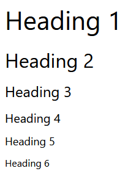


## Parágrafos

Os parágrafos contêm conteúdo de texto.

````html
<p>
   This paragraph
   contains a lot of lines
   but they are ignored.
</p>
````

O seguinte é exibido no navegador da Web: 


> Observe que colocar conteúdo em uma nova linha é ignorado pelo navegador da Web.

## Parágrafos

Os parágrafos contêm conteúdo de texto.

````html
<p>
   This paragraph
   contains a lot of lines
   but they are ignored.
</p>
````

O seguinte é exibido no navegador da Web: 

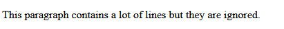

Observe que colocar conteúdo em uma nova linha é ignorado pelo navegador da Web.

## Quebras de Linha

Como você aprendeu, as quebras de linha na linha de tag de parágrafo são ignoradas pelo HTML. Em vez disso, eles devem ser especificados usando a  tag <br>. A  tag <br> não precisa de uma tag de fechamento.

````html
<p>
   This paragraph<br>
   contains a lot of lines<br>
   and they are displayed.
</p>
`````

O seguinte é exibido no navegador da Web: 

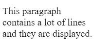

## Forte

Marcas fortes podem ser usadas para indicar que um intervalo de texto tem importância.

````html
<p>
   No matter how much the dog barks: <strong>don't feed him chocolate</strong>.
</p>
````

O seguinte é exibido no navegador da Web: 

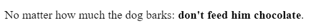

## Ousado

Tags ousadas podem ser usadas para chamar a atenção do leitor para uma variedade de textos.

````html
<p>
   The primary colors are <b>red</b>, <b>yellow</b> and <b>blue</b>.
</p>
````

O seguinte é exibido no navegador da Web: 

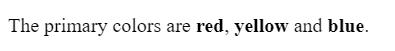

O seguinte é exibido no navegador da Web: 

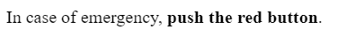

Tags ousadas devem ser usadas para chamar a atenção, mas não para indicar que algo é mais importante. Considere o seguinte exemplo:

````html
The three core technologies of the Internet are <b>HTML</b>, <b>CSS</b> and <b>Javascript</b>.
````

O seguinte é exibido no navegador da Web: 

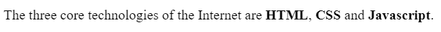

## Ênfase

As tags de ênfase podem ser usadas para adicionar ênfase ao texto.

````html
<p>
   Wake up <em>now</em>!
</p>
````

O seguinte é exibido no navegador da Web: 

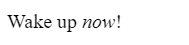

## Itálico

As tags em itálico podem ser usadas para deslocar um intervalo de texto.

````html
<p>
   The term <i>HTML</i> stands for HyperText Markup Language.
</p>
````

O seguinte é exibido no navegador da Web: 

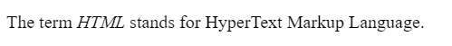

## Ênfase x Itálico

Por padrão, ambas as tags terão o mesmo efeito visual no navegador da Web. A única diferença é o significado.

As tags de ênfase enfatizam o texto contido nelas. Vamos explorar o seguinte exemplo:

````html
I <em>really</em> want ice cream
````

O seguinte é exibido no navegador da Web: 

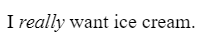

O itálico representa texto deslocado e deve ser usado para termos técnicos, títulos, um pensamento ou uma frase de outro idioma, por exemplo:

````html
My favourite book is <i>Dracula</i>.
````

O seguinte é exibido no navegador da Web: 

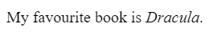

Os leitores de tela não anunciarão nenhuma diferença se uma  tag de itálico for usada.

## Listas

Você pode adicionar listas às suas páginas da Web. Há dois tipos de listas em HTML.

As listas podem ser desordenadas usando a  tag <ul>. Os itens de lista são especificados usando a  tag <li>,  por exemplo:

````html
<ul>
   <li>Tea</li>
   <li>Sugar</li>
   <li>Milk</li>
</ul>
````

Isso é exibido no navegador da Web como:

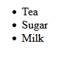

As listas também podem ser ordenadas usando a  tag <ol>. Novamente, os itens de lista são especificados usando a  tag <li>.

````html
<ol>
   <li>Rocky</li>
   <li>Rocky II</li>
   <li>Rocky III</li>
</ol>
````

Isso é exibido como o seguinte no navegador da Web.

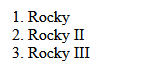

## Tags Div

Uma  tag <div> define uma divisão de conteúdo em um documento HTML. Ele atua como um contêiner genérico e não tem efeito sobre o conteúdo, a menos que seja estilizado por CSS.

O exemplo a seguir mostra  um elemento <div> que contém um elemento paragraph:

````html
<div>
   <p>This is a paragraph inside a div</p>
</div>
````

Isso é exibido como o seguinte no navegador da Web.

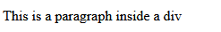

Ele pode ser aninhado dentro de outros elementos, por exemplo:

````html
<div>
   <div>
      <p>This is a paragraph inside a div that’s inside another div</p>
   </div>
</div>
````
Isso é exibido no navegador da Web como:

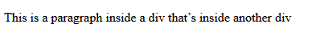

Como mencionado, o div não tem impacto no conteúdo, a menos que seja estilizado por CSS. Vamos adicionar uma pequena regra CSS que estiliza todas as divs na página.

Não se preocupe com o significado do CSS ainda, você explorará o CSS ainda mais em uma lição posterior. Em resumo, você está aplicando uma regra que adiciona uma borda e algum espaçamento visual ao elemento.

````html
<style>
   div {
      border: 1px solid black;
      padding: 2px;
   }
</style>
<div>
   <div>
      <p>This is a paragraph inside stylized divs</p>
   </div>
</div>
````

Isso é exibido no navegador da Web como:

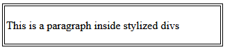

Os elementos Div são uma parte importante da criação de páginas da Web. O uso mais avançado de elementos div será explorado em outro curso.

## Comentários

Se você quiser deixar um comentário no código para outros desenvolvedores, ele pode ser adicionado como:

````html
<!-- Este é um comentário --> 
````

O comentário não será exibido no navegador da Web.

- marca de linha da tabela: `<tr></tr>`
- tag da tabela: `<table></table>`
- As tags de cabeçalho da tabela: `<th></th>`
- As tags de dados da tabela: `<td></td>`

# Noções básicas de alinhamento

## Alinhamento de texto

Alinhar texto dentro de um elemento HTML é muito simples. Para fazer isso, use a  propriedade CSS `text-align`. No exemplo a seguir, a regra CSS está definindo o texto de todos os elementos de parágrafo para ser alinhado ao centro.

````css
p {
    text-align: center;
}
````

O alinhamento do texto pode ser definido como `left` (esquerda), `right` (direita,), `center` (centro) e `justify` ( justificar).

O  alinhamento de `justify` espalha o texto para que cada linha do texto tenha a mesma largura.

O alinhamento padrão é deixado para  idiomas da `left` para a direita, como o inglês. Para idiomas da direita para a esquerda, como o árabe, o alinhamento padrão é à `right`.

## HTML Element Alignment (Alinhamento de elementos HTML)

O alinhamento do elemento HTML é mais complicado do que o alinhamento do texto. Para alinhar elementos HTML, você deve considerar o modelo de caixa e o fluxo de documentos das lições anteriores. O alinhamento de um elemento HTML é feito alterando as propriedades de seu modelo de caixa e como ele afeta o fluxo do documento.

## HTML Element Center Alignment (Alinhamento do Centro de Elementos HTML)

Para centralizar o alinhamento de um elemento, defina uma largura no elemento e empurre suas margens para fora para preencher o espaço disponível restante do elemento pai como na seguinte estrutura HTML:

````html
<div class="parent">
  <div class="child">
  </div>
</div>
````
Em seu CSS, você definirá  o elemento pai para  ter uma borda vermelha para visualizar o espaço que ele ocupa:

````css
.parent {
  border: 4px solid red;
}
````

O  elemento `child` terá uma largura igual a 50% do elemento `parent` com um preenchimento de 20 pixels. Observe que  o preenchimento: `padding: 20px`  é a abreviação para definir o preenchimento superior, inferior, esquerdo e direito para `20px`. Para visualizar o espaço que ocupa, defina a borda como verde:

````css
.child {
  width: 50%;
  padding: 20px;
  border: 4px solid green;
}
````

Para alinhar o elemento ao centro, defina sua  propriedade `margin` como `auto`. O `auto` informará ao navegador para calcular a margem automaticamente com base no espaço disponível.

````css
.child {
  width: 50%;
  padding: 20px;
  border: 4px solid green;
  margin: auto;
}
````

O resultado é que o  elemento filho `child` está centralizado no elemento pai `parent`:

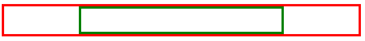

É importante observar que isso funciona porque o  elemento `div` é um elemento de nível de bloco. 

Se você quiser alinhar um elemento embutido como img, você precisará alterá-lo para um elemento de nível de bloco. Semelhante ao  exemplo `div`, você adiciona o `img` a um elemento pai:

````html
<div class="parent">
  
</div>
````

Em seguida, a regra CSS altera o  elemento `img` para um elemento de nível de bloco e define sua margem como `auto`:

````css
.child {
  display: block;
  width: 50%;
  margin: auto;
}
````

Para ser mais preciso, no CSS você pode definir apenas as margens esquerda e direita como automáticas. Isso permite que você defina as margens superior e inferior para valores específicos, se necessário.

````css
.child {
  display: block;
  width: 50%;
  margin-left: auto;
  margin-right: auto;
}
````

## Elemento HTML Alinhamento Esquerda/Direita

As duas maneiras mais comuns de alinhar elementos à esquerda e à direita são usar  a propriedade `float` e a propriedade `position`.

A  propriedade `position` tem várias opções de valor que afetam a forma como o elemento é exibido no fluxo do documento. Você explorará como usar a  propriedade `position` mais tarde. Por enquanto, vamos nos concentrar na  propriedade `flutuante`.

A  propriedade `float` define a posição de um elemento em relação ao conteúdo de texto dentro de um elemento pai. O texto será quebrado ao redor do elemento.

No exemplo a seguir, a imagem será alinhada à direita do  elemento `div`. O conteúdo do texto será quebrado ao redor da imagem:

_.HTML_

````html
<div class="parent">
   Lorem ipsum dolor sit amet, consectetur adipiscing elit. Curabitur eu odio eget leo auctor porta sit amet sit amet justo. Donec fermentum quam in diam volutpat, at lacinia diam placerat. Aenean quis feugiat sem. Suspendisse a dui massa. Phasellus scelerisque, mi vestibulum iaculis tristique, orci tellus gravida nisi, in pellentesque elit massa ut lorem. Sed elementum ornare nunc vel cursus. Duis sed enim in nulla efficitur convallis sed eget dolor. Curabitur scelerisque eros erat, in vulputate dolor consequat vel. Praesent ac sapien condimentum, ultricies libero at, auctor orci. Curabitur ut augue ac massa convallis faucibus sed in magna. Phasellus scelerisque auctor est a auctor. Nam laoreet sem sapien, porta imperdiet urna laoreet eu. Morbi dolor turpis, congue id bibendum eget, viverra et risus. Quisque vitae erat id tortor ullamcorper maximus.
</div>
````

_.CSS_

````css
.child {
  float: right;
}
````

O seguinte é exibido no navegador da Web: 
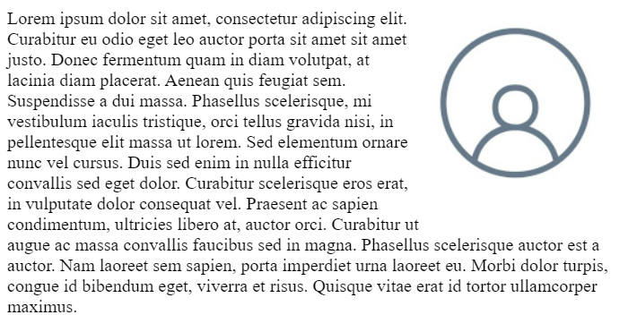

